

  <h1><ins>Rodrigo Honorio</ins></h1>
  <h3>Data Analyst | Mechanical Engineer & Programmer</h3>
  
Keen on turning data into actionable insights and sprucing up processes through a bit of tech.

---

## 🚀 Having a Go at Data: My Analysis Bootcamp

  
  
  
  
  
  

**Programme:** Data Technician Bootcamp (UK)  
**Tools I've Got to Grips With:** Excel, Power BI, Tableau, SQL, Python (Pandas), Microsoft Azure, Power Query, Matplotlib, DAX, VLOOKUP/XLOOKUP, Pivot Tables  
**Areas I've Been Focusing On:** Data Prep and Cleaning, Having a Look at Data, Whipping Up Dashboards, Making Data Look Good, Cloud Solutions, Knocking Up SQL Queries, Automating with Python, Keeping on Top of GDPR & Data Ethics

---

## 🗺️ My Learning Journey Laid Out

This repository's a record of how I've been getting on in the world of data analysis during an intensive bootcamp. You'll find my weekly bits of work, my thoughts on things, and how I've been putting various tools and ideas into practice — from the basics of Excel and Power BI right through to wrangling data with Python, SQL queries, and why data ethics is a must.

---

## 📂 What's What in Here

| Week     | Main Focus                   | Key Thing I Did                               |
|----------|------------------------------|-----------------------------------------------|
| [Week 1](Workbooks/Week_1/) | Excel and Data Governance  | VLOOKUP/XLOOKUP, Pivot Tables, DPA, GDPR        |
| [Week 2](Workbooks/Week_2/) | Power BI and Fancy Visuals | Spotify and NHS dashboards I knocked together      |
| [Week 3](Workbooks/Week_3/) | SQL and How Databases Link Up | Inner/Outer Joins, RDBMS structure explained      |
| [Week 5](Workbooks/Week_5/) | Cloud and Data Scenarios   | Azure Data Tools, Dashboard design in Power BI    |
| [Week 6](Workbooks/Week_6/) | Python for Data Crunching  | Pandas pivoting, Charts with Matplotlib          |

---

## 🖼️ Have a Gander at Some Visuals

### 📘 Week 1 – Excel Essentials: Looking Things Up, Summing Up, and Breaking Things Down

#### 🔍 The Magic of VLOOKUP/XLOOKUP in Action

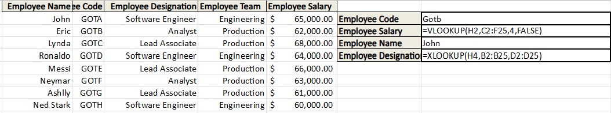  
*Using VLOOKUP/XLOOKUP to dynamically find info between tables, like employee details.*

---

#### 📊 The Power of Pivot Tables: Bike Sales Breakdown

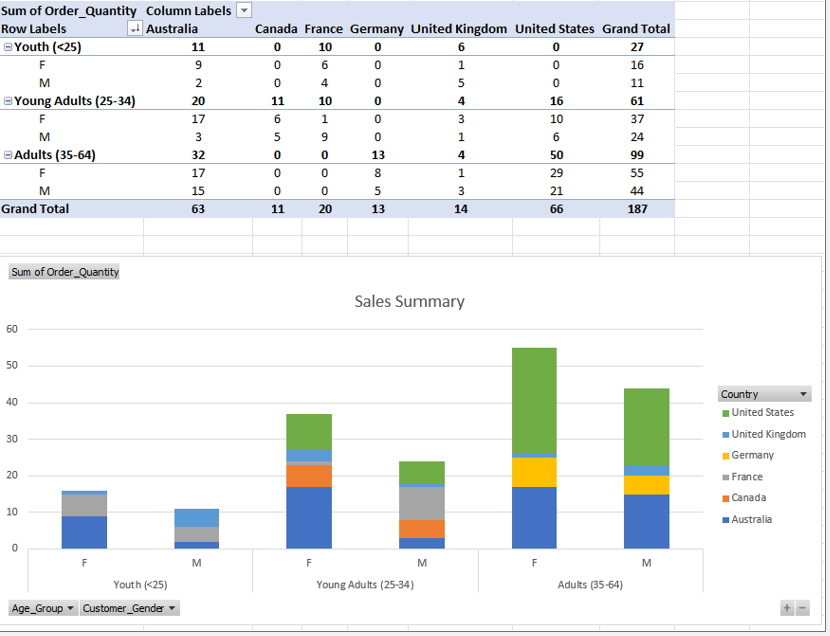  
*Summing up how sales are doing by region and product, using the handy Pivot Tables in Excel.*

---

#### 🔄 Clever Stuff with the SWITCH Function: Sorting Sales Performance

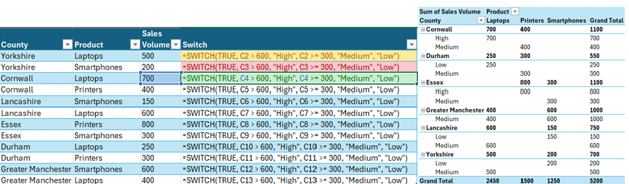  
*Customising how sales performance is categorised (High, Medium, Low) using the SWITCH function, all linked up to the summary.*

This week really got me sorted with the basics of Excel, showing how structured functions and summing-up tools like pivot tables can quickly show you what's what.

---

### 📘 Week 2 – Making Data Look Good with Tableau

#### 🎵 Unpacking Music Trends with the Spotify Dashboard

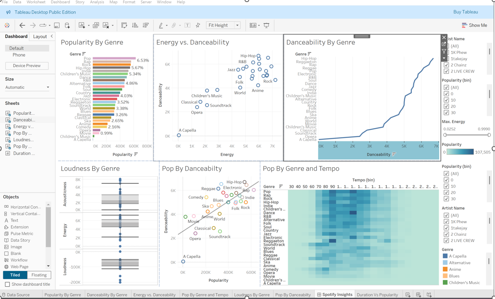  
*Having a look at listening habits across different music types in Tableau, focusing on energy, danceability, and popularity to see what gets people going.*

---

#### 📈 Looking at Job Changes in the UK (EMSI Dataset)

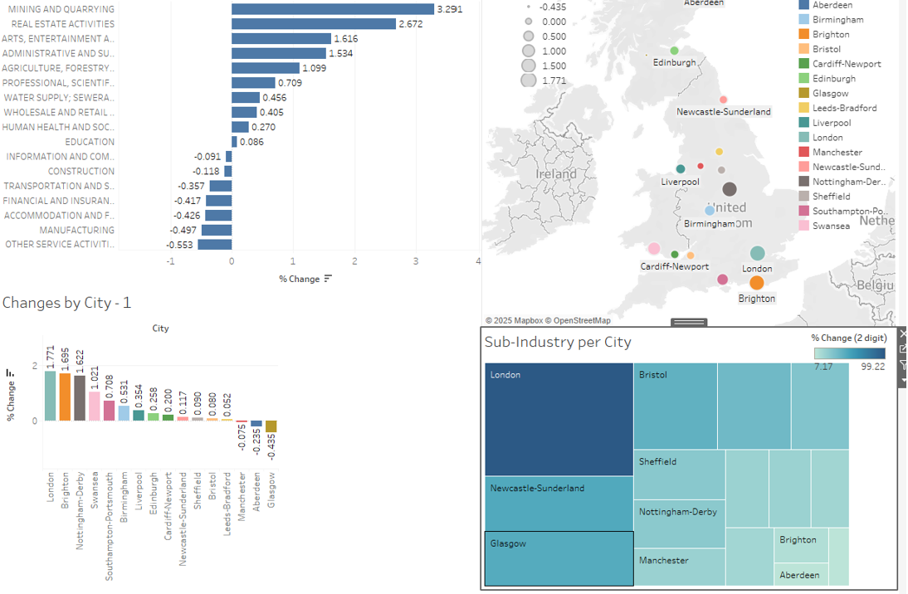  
*Showing how employment's changed using bar charts and a map of the UK, highlighting which sectors are doing what in the big cities.*

---

#### 🏥 Health Insights from the NHS in a Handy Dashboard

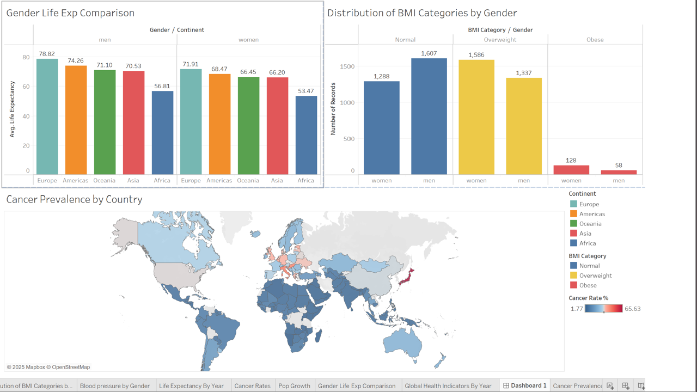  
*Analysing life expectancy, obesity levels, and cancer rates by region to help with health service planning and spotting trends.*

This week really boosted my practical skills with both Tableau and Power BI. I used Tableau to knock up interactive dashboards that showed real-world insights from music and health data, while the Power BI labs helped me get my head around loading data, changing it about, and designing reports.

---

### 📘 Week 3 – SQL and How Relational Databases Hang Together

#### 🔄 Making Sense of Data with SQL JOIN Queries

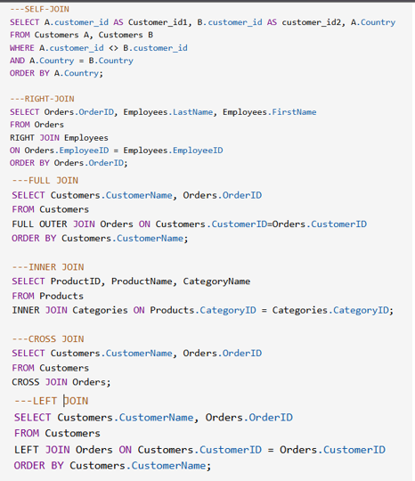  
*Using JOIN operations to bring together related tables and get the info I needed.*

---

#### 🏗️ How Databases are Put Together and Table Structures

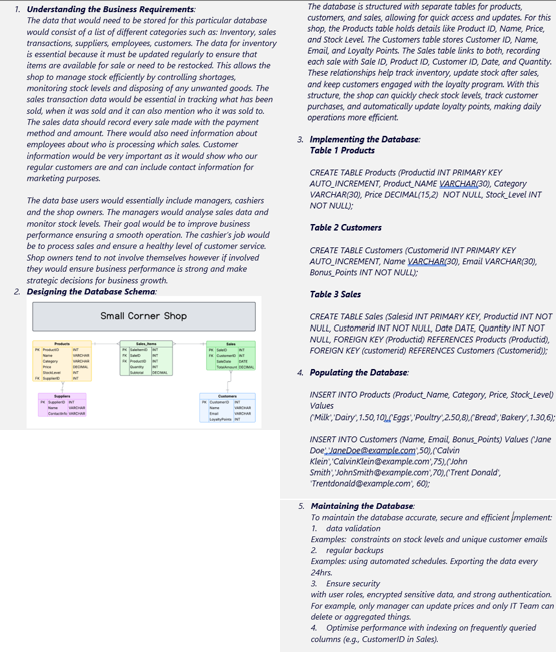  
*Outlining the structure of a database for a shop using SQL table definitions and explaining how these linked-up models help with bigger analyses.*

---

#### 📊 What SQL Queries Actually Show

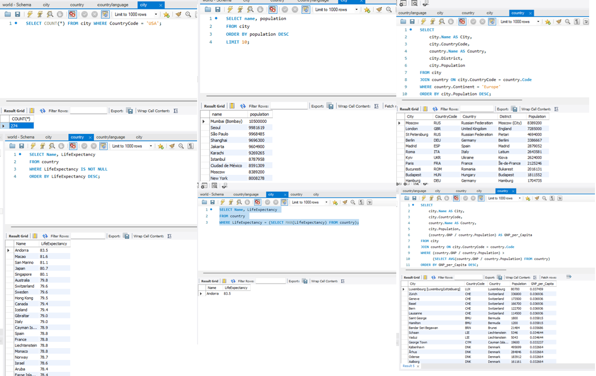  
*Running queries to filter and group data using real-world datasets to count things, set conditions, and see how different bits of data relate to each other.*

In Week 3, I was all about how relational databases are designed and how to query them with SQL. I practised using JOIN operations, filtering queries, and setting up table structures for a pretend shop. This made me much more confident in reading and writing SQL to get at structured data.

---

Week 4 – Career Development Week (non-technical – no workbook submitted)

---

### 📘 Week 5 – Cloud Platforms, Azure Labs, and Thinking About What Could Happen

#### ☁️ A Look at the Azure Labs

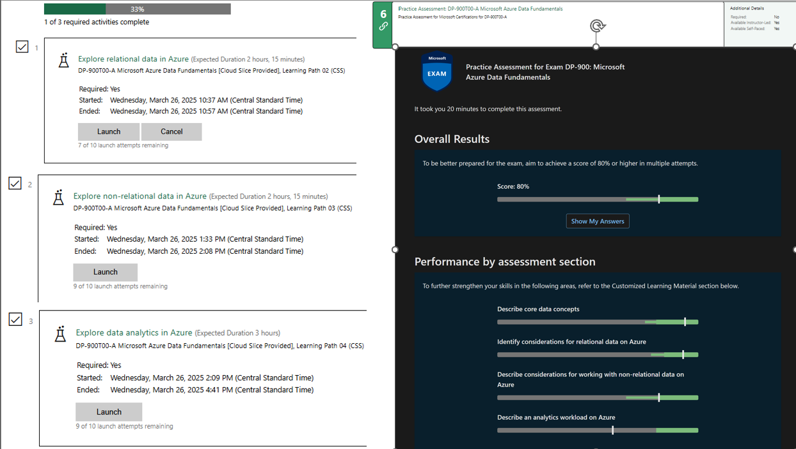  
*Working through guided labs on relational data, non-relational data, and how Azure does analytics. This included having a go with data lake storage, SQL databases, and using Azure Synapse for queries.*

---

#### 🐾 Azure Ideas – The Paws & Whiskers Case Study

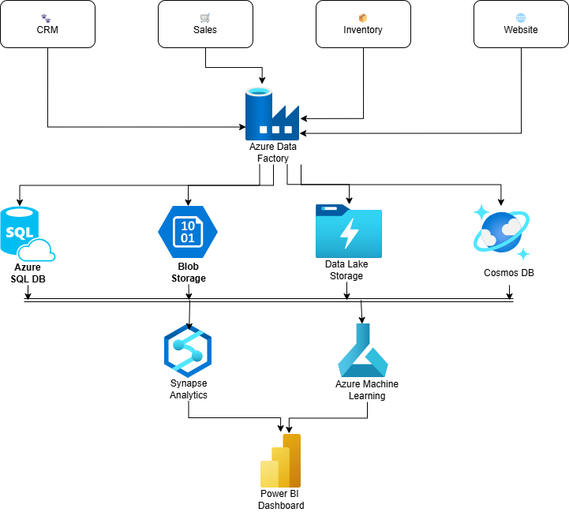  
*Putting forward a cloud setup using Azure Data Factory, Power BI, and Blob Storage to bring a pet supply company's data handling into the modern age.*

This week really deepened my understanding of cloud platforms and how data systems are put together. I looked at how Azure deals with different types of data and used that knowledge to come up with a real-world solution for a made-up business. I got a clearer picture of how data moves through cloud systems and where analysts and data engineers fit into all that.

---

### 📘 Week 6 – Python and Jupyter for Having a Good Look at Data

#### 🧮 Tidying Up and Exploring Data (Student Dataset)

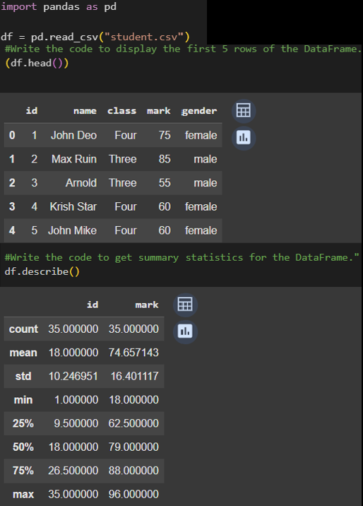  
*Loading up and having a look at student data using Pandas; sorting out missing bits and bobs and checking out the main stats.*

---

#### 📊 Grouping Things and Using Pivot Tables

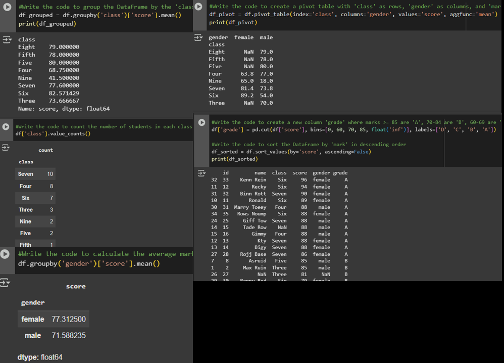  
*Creating grouped views of how students are doing by class and gender using Pandas and pivot tables.*

---

#### 🌍 Analysing GDP per Person

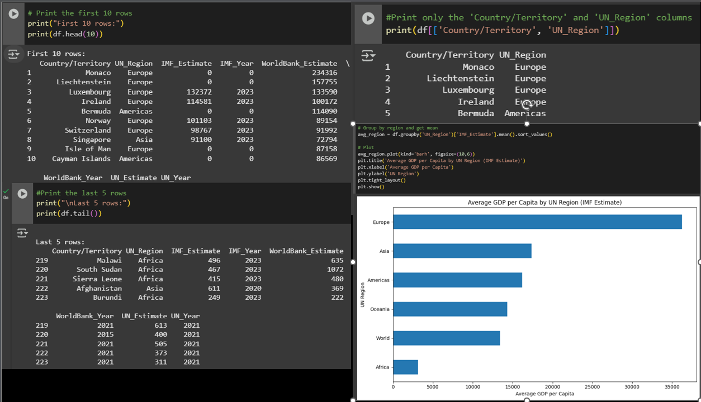  
*Looking at GDP per capita across different countries and UN regions, filtering and slicing the data using code.*

In Week 6, I used Python and the Pandas library to explore, clean up, change about, and analyse datasets using Jupyter Notebook. I worked with structured data (student.csv) and real-world data (GDP per capita), doing grouping, summing up, and pivoting. I also had a go at making data look good with Matplotlib, Seaborn, and Plotly, which has really helped me show trends and patterns clearly and interactively.

---

## ✅ Skills I've Picked Up

- Getting the hang of Excel lookups, pivot tables, and making things automatic
- Understanding how RDBMS works and writing SQL queries that do the job
- Putting together dashboards and understanding the basics of DAX in Power BI
- Using Python to wrangle data and make it visual
- Knowing about GDPR, data ethics, and cloud services (Azure)
- Creating interactive dashboards in Tableau Public to see location-based stuff and trends, using real-world datasets like EMSI (UK Job Changes) and Spotify listening habits.
- Getting familiar with **cloud computing concepts** and tools, including Azure data services

---

## 🎯 My Thoughts on How It's Going

These workbooks show how I'm coming along as someone learning to be a data analyst — balancing the technical bits, writing up my analysis, and thinking critically. Each week threw up new challenges and chances to get more confident with the whole data process.

---

👋 **Fancy a Chat?** Feel free to have a proper look at more of my work on [GitHub](https://github.com/RodrigoHonorio)
